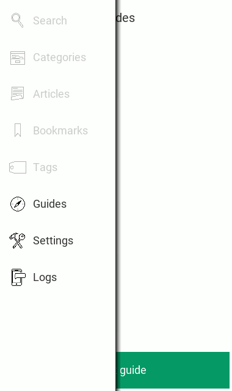

<p align="center"></p>

# Xenial

Xenial is a prototype of an application for viewing of multimedia-rich traveler guides. It's functionality and design is 
especially aimed on people voluntarily or involuntarily migrating from one country (culture, political syste, etc.) 
to another. An embedded artificial intelligence application layer is expected to present a guide content which is
most appropriate in a particular context for the application user. To learn more about our motivation to build such
an application, its proposed functionality, and expected requirements, please read the software requirements 
[SPECIFICATION.md](https://github.com/sciber/xenial/blob/master/SPECIFICATION.md) file. 


## Screenshots



## Getting Started

These instructions will get you a copy of the project up and running on your local machine for development and testing
purposes. 

### Prerequisites

The application was developed and tested on Linux using Python 3.7.5. It is build on: 

 * [kivy](https://kivy.org) - UI library for development of cross platform Python applications. 
 * [ffpyplayer](https://github.com/matham/ffpyplayer) - a python binding for the FFmpeg library for playing and writing 
 media files.
 * [pillow](https://github.com/python-pillow/Pillow) - a friendly fork of the Python Imaging Library PIL.

### Installing and testing on Linux

Clone [xenial repository](https://github.com/sciber/xenial) 
on your computer:
```
git clone git@github.com:sciber/xenial.git  
```

Install application dependencies:
```
cd xenial
pip install -r requirements.txt
```

Download a [dummy guide archive](https://raw.githubusercontent.com/sciber/xenial-guides/master/dist/dummy/alice_v0.1.zip) and copy 
into the application's guides directory (xenial/guides)

Run application mimicking a mobile device portrait mode:
```
python3 main --size=380x640
```

### Building for Android deployment

Install [buildozer](https://github.com/kivy/buildozer) and its dependencies :
```
pip install Cython==0.29.10 buildozer==1.0
```

Connect your mobile device to your Linux or OSX computer... if you do not know how, watch 
Erik SandberErik Sandberg's great video [tutorial](https://www.youtube.com/watch?v=EupAeyL8zAo). 

Build and and deploy the app to your device:
```
buildozer android debug deploy run 
```

### Installing to an Android device from APK

Download application's APK (the build includes a dummy guide) to your mobile device from [sciber/xenial-builds](https://https://github.com/sciber/xenial-builds)
repository:

<https://raw.githubusercontent.com/sciber/xenial-builds/master/android/xenial__armeabi-v7a-0.1-armeabi-v7a-debug.apk>

Install the app by tapping on downloaded APK file in Downloads folder.


## Contributing

Please read [CONTRIBUTING.md](https://github.com/sciber/xenial/blob/master/CONTRIBUTING.md) for details on our code of conduct, and the process for submitting pull requests to us.


## Versioning

The project is versioned using [SemVer](https://semver.org/). For the available versions, see the 
[tags on this repository](https://github.com/sciber/xenial/tags).


## License

This project is licensed under the MIT License - see [LICENSE.md](LICENSE.md) file for details.


## Acknowledgement

The idea of creating this application was inspired by a fictional 
[book *The Hitchhiker's Guide to the Galaxy*](https://en.wikipedia.org/wiki/The_Hitchhiker%27s_Guide_to_the_Galaxy_(fictional))
from [Douglas Adams](https://en.wikipedia.org/wiki/Douglas_Adams) 
[franchise *The Hitchhiker's Guide to the Galaxy*](https://en.wikipedia.org/wiki/The_Hitchhiker%27s_Guide_to_the_Galaxy_(fictional)).

================================================

Purpose
-------
There is an increasing number of people travelling between places on Earth.
In near future it is expected that migrating part of world population
will significantly grow in size due to war conflicts and climate change.

Main purpose of this application is to create a tool for the migrants to
achieve targets of their journey safely and comfortably thanks 
to information it provides.


Interface
---------
Content of the application is composed fo guides which are sets of 
articles/entries. The articles can be tagged and based on the assigned tags they
fall into groups called *categories*. Thus every category has assigned
set of tags and every article in a category has all tags of the category
(and possibly other tags)


Installation on Linux
---------------------
Xenial is [Python](https://www.python.org) application based on 
[Kivy](https://kivy.org) framework. It is developed and tested on 
[Ubuntu 19.04](http://releases.ubuntu.com/19.04/) and its primary
installation targets are middle-sized devices running 
[Android](https://en.wikipedia.org/wiki/Android_(operating_system))
operating system.

